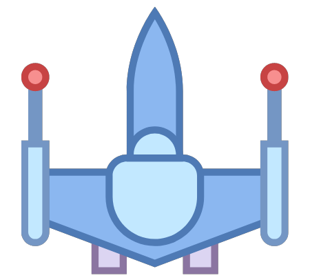
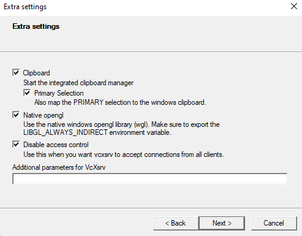

# [WATCHOUT!](https://github.com/Hans299/dockerHANDSON) 

Aplikasi ini merupakan permainan yang dibuat menggunakan library pygame tentang sebuah rocket yang bertahan dan melewati asteroid sambil menghindar dan menghancurkan asteroid dan rocket lain dan ketika 
rocket tekena dengan serangan dari rocket atau serangan asteroid.

## How To Run Docker
- Unduh repository dengan [klik disini](https://github.com/Hans299/dockerHANDSON/archive/refs/heads/main.zip) lalu pindahkan file tersebut ke disk `(D:)`
- Unduh vcxsrv dan install, fungsinya sebagai GUI untuk menjalankan game ini [klik disini](https://downloads.sourceforge.net/project/vcxsrv/vcxsrv/1.20.14.0/vcxsrv-64.1.20.14.0.installer.exe?ts=gAAAAABikM4htiS-mb2njw45IMlr5iPITdvV6w5QqC2tlvxcF5u9QUvHH742ZgREwNiP9q8K8-TvhIPFacna04QFFrmqVtzk7A%3D%3D&r=https%3A%2F%2Fsourceforge.net%2Fprojects%2Fvcxsrv%2Ffiles%2Flatest%2Fdownload)
- jalankan Xlaunch dan next hingga muncul seperti digambar, kemudian next hingga finish
<div align="center"> 

</div>

- berikutnya buka terminal dan pastikan directorynya berada pada lokasi folder d dan file yang didownload 
- sebelum lanjut pastikan docker sudah aktif
- pada terminal jalankan syntax berikut untuk build docker
```
docker build -t watchout .
```
- selanjutnya jalankan container dengan syntax berikut
```
docker run --privileged -it --rm --cap-add=SYS_PTRACE -u 0:0 -e DISPLAY=192.168.242.196:0.0 -v /d/watchout:/home/apps watchout /bin/bash
```
- lalu ketik `ls` untuk melihat file yang ada di dalam container, jika build sukses maka terlihat beberapa file dari program game ini
- terakhir jalankan syntax berikut untuk memulai game
```
python main.py
```

## Depedencies (Library)
Adapun library yang kami gunakan dalam membuat game Watchout, yaitu:
- **[Pygame](https://www.pygame.org)** merupakan library Python untuk membuat atau mengembangkan game.
- **[Random](https://docs.python.org/3/library/random.html)** merupakan library Python untuk pengacakan dalam menentukan suatu pilihan.
- **[Sys](https://docs.python.org/3/library/sys.html)** merupakan library Python untuk memanipulasi runtime Python.

## How To Play
Sebelum memulai game, kita perlu [install bahasa Python](https://dqlab.id/cara-download-dan-install-python-pada-berbagai-sistem-operasi) dan [install library Pygame](https://www.nesabamedia.com/cara-instal-pygame-di-windows/) terlebih dahulu.

Berikut kontrol dalam game:
- Press `←` to move left
- Press `→` to move down
- Press `↑` to move up
- Press `↓` to move right
- Press `SPACE` to fire

## Demo Container
[![HERE THE TUTORIAL]](isilinkYT)